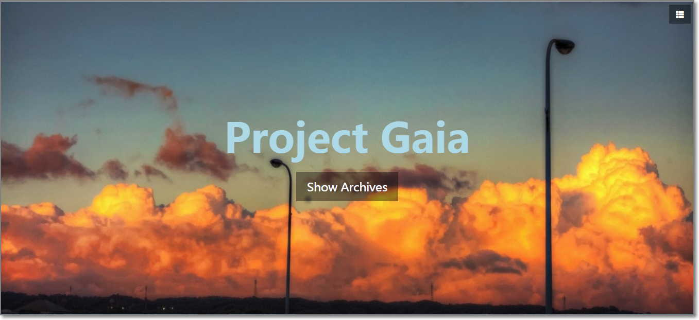
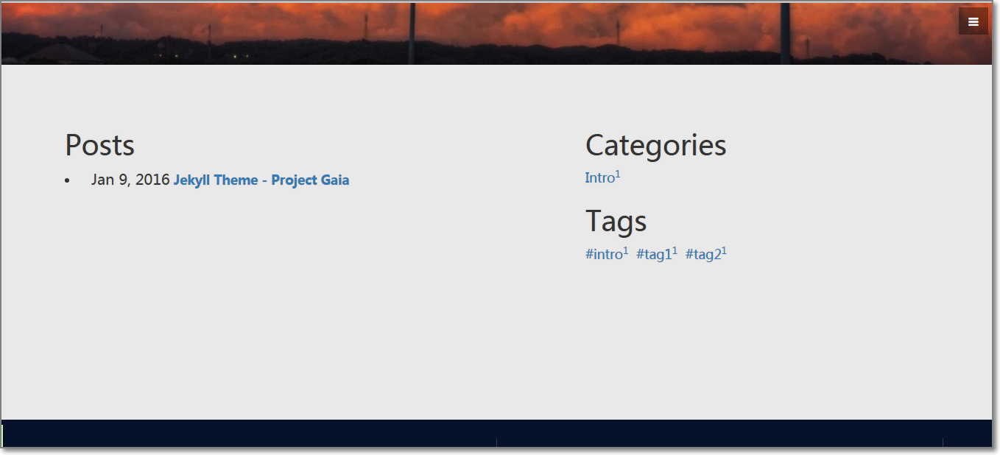
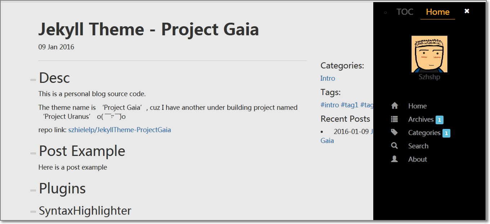
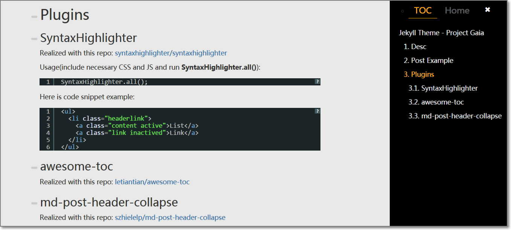
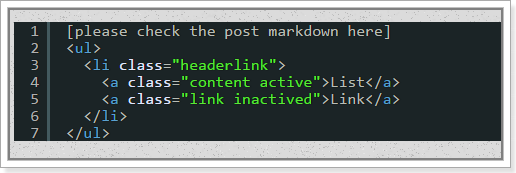
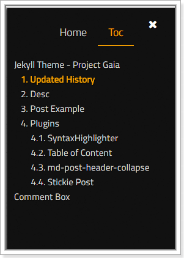
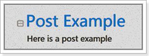

# Project Gaia

## Updated History

- May 30th, 2017
Added a reading progressbar for post page.

- May 6th, 2017
Updated font page
Added global font style

- April 3nd, 2017
Added new font

- Mar 5th, 2017
Style updated

- Mar 1st, 2017
TOC plugin updated

- Feb 28th, 2017
Rebuild to include **Bootstrap 4-Alpha** and **JQuery 3**

## Desc

## Usage

1. **Important** Please change the `baseurl` value in  `_config.yml` to your repo name
1. **Optional** If you want to use relative path instead of absolute path, delete all `{{site.url}}{{site.baseurl}}` in all layout files

## Demo

See demo page here: [    Demo Page   ](https://szhielelp.github.io/JekyllTheme-ProjectGaia/)

See extended blog here: [    Blog Page   ](http://szhshp.org/)

See chinese guide post here: [   中文指导    ](http://szhshp.org?pagename=/tech/2017/01/09/projectgaia.html)

## Plugins

### SyntaxHighlighter

Realized with this repo: [    syntaxhighlighter/syntaxhighlighter](https://github.com/syntaxhighlighter/syntaxhighlighter)

Usage(include necessary CSS and JS and run **SyntaxHighlighter.all()**):

<pre class="brush: html">
      SyntaxHighlighter.all();
</pre>

Here is code snippet example:

### Table of Content

Realized with this repo: [    jgallen23/toc  ](https://github.com/jgallen23/toc)

Auto-run when page loaded.

### md-post-header-collapse

Realized with this repo: [    szhielelp/md-post-header-collapse  ](https://github.com/szhielelp/md-post-header-collapse)

Run **$.headerCollapseRobot()** after post loaded.

<pre class="brush: js">
    /*header collapsible*/
    $.headerCollapseRobot(
      arr_Id_CollapseEnds =  new Array("end"),                       
      arr_Collapsible_Tag = new Array("H1","H2","H3"),                       
      arr_ExcludeElemPrefix_InCollapsible  = new Array("comment-"),      
      arr_ExcludeElemPrefix_InCollapsing = new Array("sidebar-toc-Ik4D-")
    )
</pre>

You can try clicking on the icons near titles.

### Stickie Post

Just put a attribute in header of the specific post:

 <pre class="brush: html; highlight: [5]">
layout: post
title: blablablalala
category : Comic
tags : [Comic, 10101]
stickie: true
</pre>

Then current post will show ahead of other posts.

### Reading Progressbar

Inspired from [http://es6.ruanyifeng.com/#docs/promise](http://es6.ruanyifeng.com/#docs/promise)

It will show your reading progress for current post.

## Extra

I would be happy if you wanna exchange the blog link with me.

Feel free to leave a msg with ur link in comment box at  [     http://szhshp.org  ](http://szhshp.org) or [   https://szhielelp.github.io/JekyllTheme-ProjectGaia/    ](https://szhielelp.github.io/JekyllTheme-ProjectGaia/)
